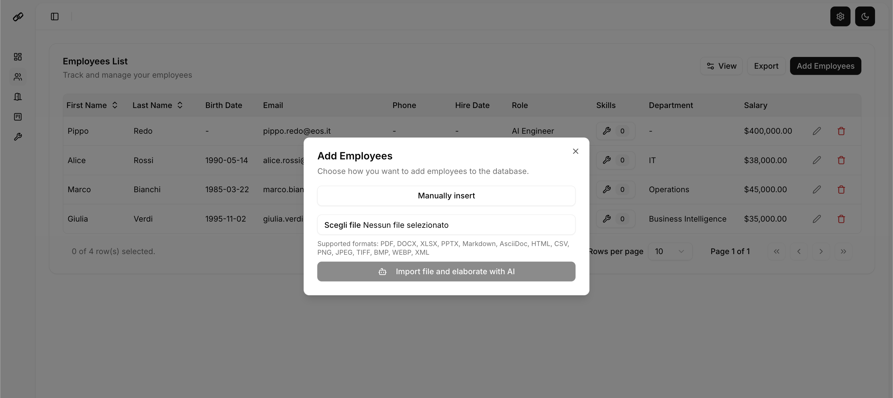
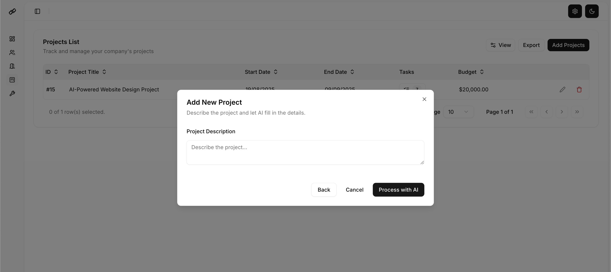

<p align="center">
    
</p>
<p align="center"><h1 align="center">EOSYNC</h1></p>
<p align="center">
	<em>AI-Powered Project and Workforce Management</em>
</p>
<p align="center">
	
	
	
	
</p>
<p align="center">
</p>
<p align="center">
</p>
<br>

## 🔗 Table of Contents

- [📍 Overview](#-overview)
- [👾 Features](#-features)
- [📁 Project Structure](#-project-structure)
  - [📂 Project Index](#-project-index)
- [🚀 Getting Started](#-getting-started)
  - [☑️ Prerequisites](#-prerequisites)
  - [⚙️ Installation](#-installation)
  - [🤖 Usage](#-usage)
  - [🧪 Testing](#-testing)
- [📌 Project Roadmap](#-project-roadmap)
- [🔰 Contributing](#-contributing)
- [🎗 License](#-license)
- [🙌 Acknowledgments](#-acknowledgments)

---

## 📍 Overview

EOSYNC is an intelligent project management and workforce optimization platform designed to streamline your team's workflow. By leveraging the power of AI, EOSYNC automates complex tasks such as employee and skills management, project creation, and task assignments. This allows managers to focus on strategic decision-making while ensuring that the right people are assigned to the right tasks at the right time. The platform features a comprehensive dashboard for a high-level overview of all ongoing activities, dedicated sections for managing employees, skills, projects, and leaves, and seamless integration of AI to boost productivity and efficiency.

---

## 👾 Features

- **AI-Powered Employee Onboarding**: Automatically populate employee profiles and skills by simply uploading a file.
- **Intelligent Project Generation**: Describe your project in a prompt and let AI break it down into manageable micro-tasks.
- **Automated Task Assignment**: EOSYNC's AI analyzes employee skills and availability to assign tasks to the best-suited team members.
- **Centralized Dashboard**: Get a comprehensive overview of your projects, team availability, and key metrics in one place.
- **Comprehensive Management**: Easily manage employees, their skills, project assignments, and leave requests through dedicated and intuitive interfaces.

<p align="center">
  <strong>Centralized Dashboard</strong><br>
  <em>Get a comprehensive overview of your projects, team availability, and key metrics in one place.</em><br>
  <br>
  
</p>

<p align="center">
  <strong>AI-Powered Employee Onboarding & Skills Management</strong><br>
  <em>Easily manage employees and view their project assignments and availability at a glance.</em><br>
  <em>Automatically populate employee profiles and manage individual skills.</em><br>
  <br>
  
</p>

<p align="center">
  <strong>Intelligent Project Generation</strong><br>
  <em>Describe your project in a prompt and let AI break it down into manageable micro-tasks.</em><br>
  <br>
  
</p>

<p align="center">
  <strong>Automated Task Assignment</strong><br>
  <em>The AI analyzes skills and availability to assign tasks to the best-suited team members.</em><br>
  <br>
  
</p>

<p align="center">
  <strong>Customizable Interface</strong><br>
  <em>Switch between light and dark modes, themes and more for your comfort.</em><br>
  <br>
  
</p>


---

## 📁 Project Structure

```sh
└── eosync/
    ├── LICENSE
    ├── README.md
    ├── app
    │   ├── .env copy
    │   ├── Dockerfile
    │   ├── __pycache__
    │   ├── agents
    │   ├── core
    │   ├── main.py
    │   ├── models
    │   ├── requirements.txt
    │   ├── routers
    │   └── schemas
    ├── docker-compose.yml
    ├── manager_ui
    │   ├── Dockerfile
    │   ├── LICENSE
    │   ├── components.json
    │   ├── eslint.config.mjs
    │   ├── next-env.d.ts
    │   ├── next.config.mjs
    │   ├── package-lock.json
    │   ├── package.json
    │   ├── postcss.config.mjs
    │   ├── public
    │   ├── src
    │   └── tsconfig.json
    ├── pyproject.toml
    └── uv.lock
```


### 📂 Project Index
<details open>
	<summary><b><code>EOSYNC/</code></b></summary>
	<details> <!-- __root__ Submodule -->
		<summary><b>__root__</b></summary>
		<blockquote>
			<table>
			<tr>
				<td><b><a href='https://github.com/Bonhollow/eosync/blob/master/pyproject.toml'>pyproject.toml</a></b></td>
				<td>Configuration file for Python project tools, including dependencies and build settings.</td>
			</tr>
			<tr>
				<td><b><a href='https://github.com/Bonhollow/eosync/blob/master/docker-compose.yml'>docker-compose.yml</a></b></td>
				<td>Defines and configures the multi-container Docker application (backend and frontend services).</td>
			</tr>
			</table>
		</blockquote>
	</details>
	<details> <!-- manager_ui Submodule -->
		<summary><b>manager_ui</b></summary>
		<blockquote>
			<table>
			<tr>
				<td><b><a href='https://github.com/Bonhollow/eosync/blob/master/manager_ui/next.config.mjs'>next.config.mjs</a></b></td>
				<td>Configuration file for the Next.js frontend application.</td>
			</tr>
			<tr>
				<td><b><a href='https://github.com/Bonhollow/eosync/blob/master/manager_ui/package-lock.json'>package-lock.json</a></b></td>
				<td>Ensures consistent installation of frontend dependencies by locking their versions.</td>
			</tr>
			<tr>
				<td><b><a href='https://github.com/Bonhollow/eosync/blob/master/manager_ui/tsconfig.json'>tsconfig.json</a></b></td>
				<td>TypeScript configuration for the frontend project.</td>
			</tr>
			<tr>
				<td><b><a href='https://github.com/Bonhollow/eosync/blob/master/manager_ui/eslint.config.mjs'>eslint.config.mjs</a></b></td>
				<td>Configuration for ESLint, a code linter for TypeScript and JavaScript.</td>
			</tr>
			<tr>
				<td><b><a href='https://github.com/Bonhollow/eosync/blob/master/manager_ui/next-env.d.ts'>next-env.d.ts</a></b></td>
				<td>TypeScript declaration file for Next.js environment variables.</td>
			</tr>
			<tr>
				<td><b><a href='https://github.com/Bonhollow/eosync/blob/master/manager_ui/postcss.config.mjs'>postcss.config.mjs</a></b></td>
				<td>Configuration file for PostCSS, a tool for transforming CSS.</td>
			</tr>
			<tr>
				<td><b><a href='https://github.com/Bonhollow/eosync/blob/master/manager_ui/package.json'>package.json</a></b></td>
				<td>Defines the project's metadata and dependencies for the frontend.</td>
			</tr>
			<tr>
				<td><b><a href='https://github.com/Bonhollow/eosync/blob/master/manager_ui/components.json'>components.json</a></b></td>
				<td>Configuration for the component library used in the UI.</td>
			</tr>
			<tr>
				<td><b><a href='https://github.com/Bonhollow/eosync/blob/master/manager_ui/Dockerfile'>Dockerfile</a></b></td>
				<td>Instructions for building the Docker image for the `manager_ui` service.</td>
			</tr>
			</table>
			<details>
				<summary><b>src</b></summary>
				<blockquote>
					<table>
					<tr>
						<td><b><a href='https://github.com/Bonhollow/eosync/blob/master/manager_ui/src/middleware.disabled.ts'>middleware.disabled.ts</a></b></td>
						<td>A disabled middleware file, intended for intercepting and processing requests in Next.js.</td>
					</tr>
					</table>
					<details>
						<summary><b>types</b></summary>
						<blockquote>
							<details>
								<summary><b>preferences</b></summary>
								<blockquote>
									<table>
									<tr>
										<td><b><a href='https://github.com/Bonhollow/eosync/blob/master/manager_ui/src/types/preferences/layout.ts'>layout.ts</a></b></td>
										<td>TypeScript type definitions for layout preferences.</td>
									</tr>
									<tr>
										<td><b><a href='https://github.com/Bonhollow/eosync/blob/master/manager_ui/src/types/preferences/theme.ts'>theme.ts</a></b></td>
										<td>TypeScript type definitions for theme preferences.</td>
									</tr>
									</table>
								</blockquote>
							</details>
						</blockquote>
					</details>
					<details>
						<summary><b>lib</b></summary>
						<blockquote>
							<table>
							<tr>
								<td><b><a href='https://github.com/Bonhollow/eosync/blob/master/manager_ui/src/lib/theme-utils.ts'>theme-utils.ts</a></b></td>
								<td>Utility functions for managing application themes.</td>
							</tr>
							<tr>
								<td><b><a href='https://github.com/Bonhollow/eosync/blob/master/manager_ui/src/lib/layout-utils.ts'>layout-utils.ts</a></b></td>
								<td>Utility functions for managing application layouts.</td>
							</tr>
							<tr>
								<td><b><a href='https://github.com/Bonhollow/eosync/blob/master/manager_ui/src/lib/utils.ts'>utils.ts</a></b></td>
								<td>General utility functions for the frontend application.</td>
							</tr>
							</table>
						</blockquote>
					</details>
					<details>
						<summary><b>styles</b></summary>
						<blockquote>
							<details>
								<summary><b>presets</b></summary>
								<blockquote>
									<table>
									<tr>
										<td><b><a href='https://github.com/Bonhollow/eosync/blob/master/manager_ui/src/styles/presets/soft-pop.css'>soft-pop.css</a></b></td>
										<td>CSS file defining the 'soft-pop' theme preset.</td>
									</tr>
									<tr>
										<td><b><a href='https://github.com/Bonhollow/eosync/blob/master/manager_ui/src/styles/presets/brutalist.css'>brutalist.css</a></b></td>
										<td>CSS file defining the 'brutalist' theme preset.</td>
									</tr>
									<tr>
										<td><b><a href='https://github.com/Bonhollow/eosync/blob/master/manager_ui/src/styles/presets/tangerine.css'>tangerine.css</a></b></td>
										<td>CSS file defining the 'tangerine' theme preset.</td>
									</tr>
									</table>
								</blockquote>
							</details>
						</blockquote>
					</details>
					<details>
						<summary><b>scripts</b></summary>
						<blockquote>
							<table>
							<tr>
								<td><b><a href='https://github.com/Bonhollow/eosync/blob/master/manager_ui/src/scripts/generate-theme-presets.ts'>generate-theme-presets.ts</a></b></td>
								<td>A script to automatically generate theme preset files.</td>
							</tr>
							</table>
						</blockquote>
					</details>
					<details>
						<summary><b>navigation</b></summary>
						<blockquote>
							<details>
								<summary><b>sidebar</b></summary>
								<blockquote>
									<table>
									<tr>
										<td><b><a href='https://github.com/Bonhollow/eosync/blob/master/manager_ui/src/navigation/sidebar/sidebar-items.ts'>sidebar-items.ts</a></b></td>
										<td>Defines the items displayed in the application's sidebar navigation.</td>
									</tr>
									</table>
								</blockquote>
							</details>
						</blockquote>
					</details>
					<details>
						<summary><b>config</b></summary>
						<blockquote>
							<table>
							<tr>
								<td><b><a href='https://github.com/Bonhollow/eosync/blob/master/manager_ui/src/config/app-config.ts'>app-config.ts</a></b></td>
								<td>Main configuration file for the frontend application.</td>
							</tr>
							</table>
						</blockquote>
					</details>
					<details>
						<summary><b>components</b></summary>
						<blockquote>
							<table>
							<tr>
								<td><b><a href='https://github.com/Bonhollow/eosync/blob/master/manager_ui/src/components/simple-icon.tsx'>simple-icon.tsx</a></b></td>
								<td>A reusable icon component.</td>
							</tr>
							</table>
							<details>
								<summary><b>data-table</b></summary>
								<blockquote>
									<table>
									<tr>
										<td><b><a href='https://github.com/Bonhollow/eosync/blob/master/manager_ui/src/components/data-table/data-table-pagination.tsx'>data-table-pagination.tsx</a></b></td>
										<td>Component for handling data table pagination.</td>
									</tr>
									<tr>
										<td><b><a href='https://github.com/Bonhollow/eosync/blob/master/manager_ui/src/components/data-table/drag-column.tsx'>drag-column.tsx</a></b></td>
										<td>Component for a draggable column in the data table.</td>
									</tr>
									<tr>
										<td><b><a href='https://github.com/Bonhollow/eosync/blob/master/manager_ui/src/components/data-table/data-table-view-options.tsx'>data-table-view-options.tsx</a></b></td>
										<td>Component for managing view options in the data table (e.g., hiding/showing columns).</td>
									</tr>
									<tr>
										<td><b><a href='https://github.com/Bonhollow/eosync/blob/master/manager_ui/src/components/data-table/data-table.tsx'>data-table.tsx</a></b></td>
										<td>The main data table component.</td>
									</tr>
									<tr>
										<td><b><a href='https://github.com/Bonhollow/eosync/blob/master/manager_ui/src/components/data-table/table-utils.ts'>table-utils.ts</a></b></td>
										<td>Utility functions for the data table components.</td>
									</tr>
									<tr>
										<td><b><a href='https://github.com/Bonhollow/eosync/blob/master/manager_ui/src/components/data-table/data-table-column-header.tsx'>data-table-column-header.tsx</a></b></td>
										<td>Component for the header of a data table column.</td>
									</tr>
									<tr>
										<td><b><a href='https://github.com/Bonhollow/eosync/blob/master/manager_ui/src/components/data-table/draggable-row.tsx'>draggable-row.tsx</a></b></td>
										<td>Component for a draggable row in the data table.</td>
									</tr>
									</table>
								</blockquote>
							</details>
							<details>
								<summary><b>ui</b></summary>
								<blockquote>
									<table>
									<tr>
										<td><b><a href='https://github.com/Bonhollow/eosync/blob/master/manager_ui/src/components/ui/context-menu.tsx'>context-menu.tsx</a></b></td>
										<td>A context menu component.</td>
									</tr>
									<tr>
										<td><b><a href='https://github.com/Bonhollow/eosync/blob/master/manager_ui/src/components/ui/accordion.tsx'>accordion.tsx</a></b></td>
										<td>An accordion component.</td>
									</tr>
									<tr>
										<td><b><a href='https://github.com/Bonhollow/eosync/blob/master/manager_ui/src/components/ui/alert-dialog.tsx'>alert-dialog.tsx</a></b></td>
										<td>An alert dialog component.</td>
									</tr>
									<tr>
										<td><b><a href='https://github.com/Bonhollow/eosync/blob/master/manager_ui/src/components/ui/radio-group.tsx'>radio-group.tsx</a></b></td>
										<td>A radio group component.</td>
									</tr>
									<tr>
										<td><b><a href='https://github.com/Bonhollow/eosync/blob/master/manager_ui/src/components/ui/checkbox.tsx'>checkbox.tsx</a></b></td>
										<td>A checkbox component.</td>
									</tr>
									<tr>
										<td><b><a href='https://github.com/Bonhollow/eosync/blob/master/manager_ui/src/components/ui/input-otp.tsx'>input-otp.tsx</a></b></td>
										<td>An input component for one-time passwords.</td>
									</tr>
									<tr>
										<td><b><a href='https://github.com/Bonhollow/eosync/blob/master/manager_ui/src/components/ui/sheet.tsx'>sheet.tsx</a></b></td>
										<td>A sheet component (side panel).</td>
									</tr>
									<tr>
										<td><b><a href='https://github.com/Bonhollow/eosync/blob/master/manager_ui/src/components/ui/progress.tsx'>progress.tsx</a></b></td>
										<td>A progress bar component.</td>
									</tr>
									<tr>
										<td><b><a href='https://github.com/Bonhollow/eosync/blob/master/manager_ui/src/components/ui/badge.tsx'>badge.tsx</a></b></td>
										<td>A badge component.</td>
									</tr>
									<tr>
										<td><b><a href='https://github.com/Bonhollow/eosync/blob/master/manager_ui/src/components/ui/breadcrumb.tsx'>breadcrumb.tsx</a></b></td>
										<td>A breadcrumb navigation component.</td>
									</tr>
									<tr>
										<td><b><a href='https://github.com/Bonhollow/eosync/blob/master/manager_ui/src/components/ui/sidebar.tsx'>sidebar.tsx</a></b></td>
										<td>A sidebar component.</td>
									</tr>
									<tr>
										<td><b><a href='https://github.com/Bonhollow/eosync/blob/master/manager_ui/src/components/ui/pagination.tsx'>pagination.tsx</a></b></td>
										<td>A pagination component.</td>
									</tr>
									<tr>
										<td><b><a href='https://github.com/Bonhollow/eosync/blob/master/manager_ui/src/components/ui/label.tsx'>label.tsx</a></b></td>
										<td>A label component for form elements.</td>
									</tr>
									<tr>
										<td><b><a href='https://github.com/Bonhollow/eosync/blob/master/manager_ui/src/components/ui/scroll-area.tsx'>scroll-area.tsx</a></b></td>
										<td>A scrollable area component.</td>
									</tr>
									<tr>
										<td><b><a href='https://github.com/Bonhollow/eosync/blob/master/manager_ui/src/components/ui/input.tsx'>input.tsx</a></b></td>
										<td>A standard input field component.</td>
									</tr>
									<tr>
										<td><b><a href='https://github.com/Bonhollow/eosync/blob/master/manager_ui/src/components/ui/textarea.tsx'>textarea.tsx</a></b></td>
										<td>A textarea component.</td>
									</tr>
									<tr>
										<td><b><a href='https://github.com/Bonhollow/eosync/blob/master/manager_ui/src/components/ui/separator.tsx'>separator.tsx</a></b></td>
										<td>A separator line component.</td>
									</tr>
									<tr>
										<td><b><a href='https://github.com/Bonhollow/eosync/blob/master/manager_ui/src/components/ui/toggle-group.tsx'>toggle-group.tsx</a></b></td>
										<td>A group of toggle buttons.</td>
									</tr>
									<tr>
										<td><b><a href='https://github.com/Bonhollow/eosync/blob/master/manager_ui/src/components/ui/command.tsx'>command.tsx</a></b></td>
										<td>A command menu component (e.g., for search).</td>
									</tr>
									<tr>
										<td><b><a href='https://github.com/Bonhollow/eosync/blob/master/manager_ui/src/components/ui/popover.tsx'>popover.tsx</a></b></td>
										<td>A popover component.</td>
									</tr>
									<tr>
										<td><b><a href='https://github.com/Bonhollow/eosync/blob/master/manager_ui/src/components/ui/slider.tsx'>slider.tsx</a></b></td>
										<td>A slider component.</td>
									</tr>
									<tr>
										<td><b><a href='https://github.com/Bonhollow/eosync/blob/master/manager_ui/src/components/ui/form.tsx'>form.tsx</a></b></td>
										<td>A form component.</td>
									</tr>
									<tr>
										<td><b><a href='https://github.com/Bonhollow/eosync/blob/master/manager_ui/src/components/ui/select.tsx'>select.tsx</a></b></td>
										<td>A select (dropdown) component.</td>
									</tr>
									<tr>
										<td><b><a href='https://github.com/Bonhollow/eosync/blob/master/manager_ui/src/components/ui/button.tsx'>button.tsx</a></b></td>
										<td>A button component.</td>
									</tr>
									<tr>
										<td><b><a href='https://github.com/Bonhollow/eosync/blob/master/manager_ui/src/components/ui/drawer.tsx'>drawer.tsx</a></b></td>
										<td>A drawer component.</td>
									</tr>
									<tr>
										<td><b><a href='https://github.com/Bonhollow/eosync/blob/master/manager_ui/src/components/ui/toggle.tsx'>toggle.tsx</a></b></td>
										<td>A toggle switch component.</td>
									</tr>
									<tr>
										<td><b><a href='https://github.com/Bonhollow/eosync/blob/master/manager_ui/src/components/ui/dialog.tsx'>dialog.tsx</a></b></td>
										<td>A dialog (modal) component.</td>
									</tr>
									<tr>
										<td><b><a href='https://github.com/Bonhollow/eosync/blob/master/manager_ui/src/components/ui/alert.tsx'>alert.tsx</a></b></td>
										<td>An alert message component.</td>
									</tr>
									<tr>
										<td><b><a href='https://github.com/Bonhollow/eosync/blob/master/manager_ui/src/components/ui/carousel.tsx'>carousel.tsx</a></b></td>
										<td>A carousel component.</td>
									</tr>
									<tr>
										<td><b><a href='https://github.com/Bonhollow/eosync/blob/master/manager_ui/src/components/ui/navigation-menu.tsx'>navigation-menu.tsx</a></b></td>
										<td>A navigation menu component.</td>
									</tr>
									<tr>
										<td><b><a href='https://github.com/Bonhollow/eosync/blob/master/manager_ui/src/components/ui/table.tsx'>table.tsx</a></b></td>
										<td>A table component.</td>
									</tr>
									<tr>
										<td><b><a href='https://github.com/Bonhollow/eosync/blob/master/manager_ui/src/components/ui/tabs.tsx'>tabs.tsx</a></b></td>
										<td>A tabs component.</td>
									</tr>
									<tr>
										<td><b><a href='https://github.com/Bonhollow/eosync/blob/master/manager_ui/src/components/ui/skeleton.tsx'>skeleton.tsx</a></b></td>
										<td>A skeleton loader component.</td>
									</tr>
									<tr>
										<td><b><a href='https://github.com/Bonhollow/eosync/blob/master/manager_ui/src/components/ui/switch.tsx'>switch.tsx</a></b></td>
										<td>A switch component.</td>
									</tr>
									<tr>
										<td><b><a href='https://github.com/Bonhollow/eosync/blob/master/manager_ui/src/components/ui/dropdown-menu.tsx'>dropdown-menu.tsx</a></b></td>
										<td>A dropdown menu component.</td>
									</tr>
									<tr>
										<td><b><a href='https://github.com/Bonhollow/eosync/blob/master/manager_ui/src/components/ui/collapsible.tsx'>collapsible.tsx</a></b></td>
										<td>A collapsible content component.</td>
									</tr>
									<tr>
										<td><b><a href='https://github.com/Bonhollow/eosync/blob/master/manager_ui/src/components/ui/menubar.tsx'>menubar.tsx</a></b></td>
										<td>A menu bar component.</td>
									</tr>
									<tr>
										<td><b><a href='https://github.com/Bonhollow/eosync/blob/master/manager_ui/src/components/ui/resizable.tsx'>resizable.tsx</a></b></td>
										<td>A resizable panel component.</td>
									</tr>
									<tr>
										<td><b><a href='https://github.com/Bonhollow/eosync/blob/master/manager_ui/src/components/ui/chart.tsx'>chart.tsx</a></b></td>
										<td>A chart component for data visualization.</td>
									</tr>
									<tr>
										<td><b><a href='https://github.com/Bonhollow/eosync/blob/master/manager_ui/src/components/ui/avatar.tsx'>avatar.tsx</a></b></td>
										<td>An avatar component.</td>
									</tr>
									<tr>
										<td><b><a href='https://github.com/Bonhollow/eosync/blob/master/manager_ui/src/components/ui/hover-card.tsx'>hover-card.tsx</a></b></td>
										<td>A card that appears on hover.</td>
									</tr>
									<tr>
										<td><b><a href='https://github.com/Bonhollow/eosync/blob/master/manager_ui/src/components/ui/aspect-ratio.tsx'>aspect-ratio.tsx</a></b></td>
										<td>A component for maintaining aspect ratio.</td>
									</tr>
									<tr>
										<td><b><a href='https://github.com/Bonhollow/eosync/blob/master/manager_ui/src/components/ui/calendar.tsx'>calendar.tsx</a></b></td>
										<td>A calendar component.</td>
									</tr>
									<tr>
										<td><b><a href='https://github.com/Bonhollow/eosync/blob/master/manager_ui/src/components/ui/tooltip.tsx'>tooltip.tsx</a></b></td>
										<td>A tooltip component.</td>
									</tr>
									<tr>
										<td><b><a href='https://github.com/Bonhollow/eosync/blob/master/manager_ui/src/components/ui/sonner.tsx'>sonner.tsx</a></b></td>
										<td>A toast notification component.</td>
									</tr>
									<tr>
										<td><b><a href='https://github.com/Bonhollow/eosync/blob/master/manager_ui/src/components/ui/card.tsx'>card.tsx</a></b></td>
										<td>A card component.</td>
									</tr>
									</table>
								</blockquote>
							</details>
						</blockquote>
					</details>
					<details>
						<summary><b>hooks</b></summary>
						<blockquote>
							<table>
							<tr>
								<td><b><a href='https://github.com/Bonhollow/eosync/blob/master/manager_ui/src/hooks/use-mobile.ts'>use-mobile.ts</a></b></td>
								<td>A React hook to detect if the application is running on a mobile device.</td>
							</tr>
							<tr>
								<td><b><a href='https://github.com/Bonhollow/eosync/blob/master/manager_ui/src/hooks/use-data-table-instance.ts'>use-data-table-instance.ts</a></b></td>
								<td>A React hook for managing the state of a data table instance.</td>
							</tr>
							</table>
						</blockquote>
					</details>
					<details>
						<summary><b>server</b></summary>
						<blockquote>
							<table>
							<tr>
								<td><b><a href='https://github.com/Bonhollow/eosync/blob/master/manager_ui/src/server/server-actions.ts'>server-actions.ts</a></b></td>
								<td>Defines server-side actions for the Next.js application.</td>
							</tr>
							</table>
						</blockquote>
					</details>
					<details>
						<summary><b>app</b></summary>
						<blockquote>
							<table>
							<tr>
								<td><b><a href='https://github.com/Bonhollow/eosync/blob/master/manager_ui/src/app/layout.tsx'>layout.tsx</a></b></td>
								<td>The root layout for the Next.js application.</td>
							</tr>
							<tr>
								<td><b><a href='https://github.com/Bonhollow/eosync/blob/master/manager_ui/src/app/globals.css'>globals.css</a></b></td>
								<td>Global CSS styles for the application.</td>
							</tr>
							</table>
							<details>
								<summary><b>(main)</b></summary>
								<blockquote>
									<details>
										<summary><b>dashboard</b></summary>
										<blockquote>
											<table>
											<tr>
												<td><b><a href='https://github.com/Bonhollow/eosync/blob/master/manager_ui/src/app/(main)/dashboard/layout.tsx'>layout.tsx</a></b></td>
												<td>The layout for the main dashboard section.</td>
											</tr>
											<tr>
												<td><b><a href='https://github.com/Bonhollow/eosync/blob/master/manager_ui/src/app/(main)/dashboard/page.tsx'>page.tsx</a></b></td>
												<td>The main dashboard page component.</td>
											</tr>
											</table>
											<details>
												<summary><b>employees</b></summary>
												<blockquote>
													<table>
													<tr>
														<td><b><a href='https://github.com/Bonhollow/eosync/blob/master/manager_ui/src/app/(main)/dashboard/employees/page.tsx'>page.tsx</a></b></td>
														<td>The page component for managing employees.</td>
													</tr>
													</table>
													<details>
														<summary><b>_components</b></summary>
														<blockquote>
															<table>
															<tr>
																<td><b><a href='https://github.com/Bonhollow/eosync/blob/master/manager_ui/src/app/(main)/dashboard/employees/_components/schema.ts'>schema.ts</a></b></td>
																<td>Defines the data schema for employees.</td>
															</tr>
															<tr>
																<td><b><a href='https://github.com/Bonhollow/eosync/blob/master/manager_ui/src/app/(main)/dashboard/employees/_components/columns.employee.tsx'>columns.employee.tsx</a></b></td>
																<td>Defines the columns for the employee data table.</td>
															</tr>
															<tr>
																<td><b><a href='https://github.com/Bonhollow/eosync/blob/master/manager_ui/src/app/(main)/dashboard/employees/_components/table-cards.tsx'>table-cards.tsx</a></b></td>
																<td>A component to display employee data in card format.</td>
															</tr>
															</table>
														</blockquote>
													</details>
													<details>
														<summary><b>utils</b></summary>
														<blockquote>
															<table>
															<tr>
																<td><b><a href='https://github.com/Bonhollow/eosync/blob/master/manager_ui/src/app/(main)/dashboard/employees/utils/customStyles.ts'>customStyles.ts</a></b></td>
																<td>Custom styles related to the employees page.</td>
															</tr>
															<tr>
																<td><b><a href='https://github.com/Bonhollow/eosync/blob/master/manager_ui/src/app/(main)/dashboard/employees/utils/api.ts'>api.ts</a></b></td>
																<td>API utility functions for fetching and managing employee data.</td>
															</tr>
															</table>
														</blockquote>
													</details>
												</blockquote>
											</details>
											<details>
												<summary><b>[...not-found]</b></summary>
												<blockquote>
													<table>
													<tr>
														<td><b><a href='https://github.com/Bonhollow/eosync/blob/master/manager_ui/src/app/(main)/dashboard/[...not-found]/page.tsx'>page.tsx</a></b></td>
														<td>A catch-all page for handling not-found routes within the dashboard.</td>
													</tr>
													</table>
												</blockquote>
											</details>
											<details>
												<summary><b>skills</b></summary>
												<blockquote>
													<table>
													<tr>
														<td><b><a href='https://github.com/Bonhollow/eosync/blob/master/manager_ui/src/app/(main)/dashboard/skills/page.tsx'>page.tsx</a></b></td>
														<td>The page component for managing employee skills.</td>
													</tr>
													</table>
													<details>
														<summary><b>_components</b></summary>
														<blockquote>
															<table>
															<tr>
																<td><b><a href='https://github.com/Bonhollow/eosync/blob/master/manager_ui/src/app/(main)/dashboard/skills/_components/columns.skill.tsx'>columns.skill.tsx</a></b></td>
																<td>Defines the columns for the skills data table.</td>
															</tr>
															<tr>
																<td><b><a href='https://github.com/Bonhollow/eosync/blob/master/manager_ui/src/app/(main)/dashboard/skills/_components/schema.ts'>schema.ts</a></b></td>
																<td>Defines the data schema for skills.</td>
															</tr>
															<tr>
																<td><b><a href='https://github.com/Bonhollow/eosync/blob/master/manager_ui/src/app/(main)/dashboard/skills/_components/table-cards.tsx'>table-cards.tsx</a></b></td>
																<td>A component to display skills data in card format.</td>
															</tr>
															</table>
														</blockquote>
													</details>
													<details>
														<summary><b>utils</b></summary>
														<blockquote>
															<table>
															<tr>
																<td><b><a href='https://github.com/Bonhollow/eosync/blob/master/manager_ui/src/app/(main)/dashboard/skills/utils/api.ts'>api.ts</a></b></td>
																<td>API utility functions for fetching and managing skills data.</td>
															</tr>
															</table>
														</blockquote>
													</details>
												</blockquote>
											</details>
											<details>
												<summary><b>projects</b></summary>
												<blockquote>
													<table>
													<tr>
														<td><b><a href='https://github.com/Bonhollow/eosync/blob/master/manager_ui/src/app/(main)/dashboard/projects/page.tsx'>page.tsx</a></b></td>
														<td>The page component for managing projects.</td>
													</tr>
													</table>
													<details>
														<summary><b>_components</b></summary>
														<blockquote>
															<table>
															<tr>
																<td><b><a href='https://github.com/Bonhollow/eosync/blob/master/manager_ui/src/app/(main)/dashboard/projects/_components/schema.ts'>schema.ts</a></b></td>
																<td>Defines the data schema for projects.</td>
															</tr>
															<tr>
																<td><b><a href='https://github.com/Bonhollow/eosync/blob/master/manager_ui/src/app/(main)/dashboard/projects/_components/columns.project.tsx'>columns.project.tsx</a></b></td>
																<td>Defines the columns for the projects data table.</td>
															</tr>
															<tr>
																<td><b><a href='https://github.com/Bonhollow/eosync/blob/master/manager_ui/src/app/(main)/dashboard/projects/_components/table-cards.tsx'>table-cards.tsx</a></b></td>
																<td>A component to display project data in card format.</td>
															</tr>
															</table>
														</blockquote>
													</details>
													<details>
														<summary><b>utils</b></summary>
														<blockquote>
															<table>
															<tr>
																<td><b><a href='https://github.com/Bonhollow/eosync/blob/master/manager_ui/src/app/(main)/dashboard/projects/utils/api.ts'>api.ts</a></b></td>
																<td>API utility functions for fetching and managing project data.</td>
															</tr>
															</table>
														</blockquote>
													</details>
												</blockquote>
											</details>
											<details>
												<summary><b>leaves</b></summary>
												<blockquote>
													<table>
													<tr>
														<td><b><a href='https://github.com/Bonhollow/eosync/blob/master/manager_ui/src/app/(main)/dashboard/leaves/page.tsx'>page.tsx</a></b></td>
														<td>The page component for managing employee leaves.</td>
													</tr>
													</table>
													<details>
														<summary><b>_components</b></summary>
														<blockquote>
															<table>
															<tr>
																<td><b><a href='https://github.com/Bonhollow/eosync/blob/master/manager_ui/src/app/(main)/dashboard/leaves/_components/columns.leave.tsx'>columns.leave.tsx</a></b></td>
																<td>Defines the columns for the leaves data table.</td>
															</tr>
															<tr>
																<td><b><a href='https://github.com/Bonhollow/eosync/blob/master/manager_ui/src/app/(main)/dashboard/leaves/_components/schema.ts'>schema.ts</a></b></td>
																<td>Defines the data schema for leaves.</td>
															</tr>
															<tr>
																<td><b><a href='https://github.com/Bonhollow/eosync/blob/master/manager_ui/src/app/(main)/dashboard/leaves/_components/table-cards.tsx'>table-cards.tsx</a></b></td>
																<td>A component to display leave data in card format.</td>
															</tr>
															</table>
														</blockquote>
													</details>
													<details>
														<summary><b>utils</b></summary>
														<blockquote>
															<table>
															<tr>
																<td><b><a href='https://github.com/Bonhollow/eosync/blob/master/manager_ui/src/app/(main)/dashboard/leaves/utils/api.ts'>api.ts</a></b></td>
																<td>API utility functions for fetching and managing leave data.</td>
															</tr>
															</table>
														</blockquote>
													</details>
												</blockquote>
											</details>
											<details>
												<summary><b>default</b></summary>
												<blockquote>
													<table>
													<tr>
														<td><b><a href='https://github.com/Bonhollow/eosync/blob/master/manager_ui/src/app/(main)/dashboard/default/page.tsx'>page.tsx</a></b></td>
														<td>The default page of the dashboard, showing an overview.</td>
													</tr>
													</table>
													<details>
														<summary><b>_components</b></summary>
														<blockquote>
															<table>
															<tr>
																<td><b><a href='https://github.com/Bonhollow/eosync/blob/master/manager_ui/src/app/(main)/dashboard/default/_components/overview-cards.tsx'>overview-cards.tsx</a></b></td>
																<td>Components for displaying overview cards on the main dashboard page.</td>
															</tr>
															<tr>
																<td><b><a href='https://github.com/Bonhollow/eosync/blob/master/manager_ui/src/app/(main)/dashboard/default/_components/employee-assignments-card.tsx'>employee-assignments-card.tsx</a></b></td>
																<td>A card component showing employee assignments.</td>
															</tr>
															<tr>
																<td><b><a href='https://github.com/Bonhollow/eosync/blob/master/manager_ui/src/app/(main)/dashboard/default/_components/operational-cards.tsx'>operational-cards.tsx</a></b></td>
																<td>Components for displaying operational metrics on the dashboard.</td>
															</tr>
															</table>
														</blockquote>
													</details>
													<details>
														<summary><b>utils</b></summary>
														<blockquote>
															<table>
															<tr>
																<td><b><a href='https://github.com/Bonhollow/eosync/blob/master/manager_ui/src/app/(main)/dashboard/default/utils/types.ts'>types.ts</a></b></td>
																<td>TypeScript type definitions for the default dashboard page.</td>
															</tr>
															<tr>
																<td><b><a href='https://github.com/Bonhollow/eosync/blob/master/manager_ui/src/app/(main)/dashboard/default/utils/api.ts'>api.ts</a></b></td>
																<td>API utility functions for the default dashboard page.</td>
															</tr>
															</table>
														</blockquote>
													</details>
												</blockquote>
											</details>
											<details>
												<summary><b>_components</b></summary>
												<blockquote>
													<details>
														<summary><b>sidebar</b></summary>
														<blockquote>
															<table>
															<tr>
																<td><b><a href='https://github.com/Bonhollow/eosync/blob/master/manager_ui/src/app/(main)/dashboard/_components/sidebar/layout-controls.tsx'>layout-controls.tsx</a></b></td>
																<td>Component for layout controls in the sidebar.</td>
															</tr>
															<tr>
																<td><b><a href='https://github.com/Bonhollow/eosync/blob/master/manager_ui/src/app/(main)/dashboard/_components/sidebar/nav-user.tsx'>nav-user.tsx</a></b></td>
																<td>Component for the user navigation section in the sidebar.</td>
															</tr>
															<tr>
																<td><b><a href='https://github.com/Bonhollow/eosync/blob/master/manager_ui/src/app/(main)/dashboard/_components/sidebar/app-sidebar.tsx'>app-sidebar.tsx</a></b></td>
																<td>The main application sidebar component.</td>
															</tr>
															<tr>
																<td><b><a href='https://github.com/Bonhollow/eosync/blob/master/manager_ui/src/app/(main)/dashboard/_components/sidebar/nav-documents.tsx'>nav-documents.tsx</a></b></td>
																<td>Component for the documents navigation section in the sidebar.</td>
															</tr>
															<tr>
																<td><b><a href='https://github.com/Bonhollow/eosync/blob/master/manager_ui/src/app/(main)/dashboard/_components/sidebar/nav-secondary.tsx'>nav-secondary.tsx</a></b></td>
																<td>Component for the secondary navigation section in the sidebar.</td>
															</tr>
															<tr>
																<td><b><a href='https://github.com/Bonhollow/eosync/blob/master/manager_ui/src/app/(main)/dashboard/_components/sidebar/nav-main.tsx'>nav-main.tsx</a></b></td>
																<td>Component for the main navigation section in the sidebar.</td>
															</tr>
															<tr>
																<td><b><a href='https://github.com/Bonhollow/eosync/blob/master/manager_ui/src/app/(main)/dashboard/_components/sidebar/theme-switcher.tsx'>theme-switcher.tsx</a></b></td>
																<td>Component for switching between themes.</td>
															</tr>
															</table>
														</blockquote>
													</details>
												</blockquote>
											</details>
										</blockquote>
									</details>
								</blockquote>
							</details>
						</blockquote>
					</details>
					<details>
						<summary><b>stores</b></summary>
						<blockquote>
							<details>
								<summary><b>preferences</b></summary>
								<blockquote>
									<table>
									<tr>
										<td><b><a href='https://github.com/Bonhollow/eosync/blob/master/manager_ui/src/stores/preferences/preferences-store.ts'>preferences-store.ts</a></b></td>
										<td>A state management store for user preferences.</td>
									</tr>
									<tr>
										<td><b><a href='https://github.com/Bonhollow/eosync/blob/master/manager_ui/src/stores/preferences/preferences-provider.tsx'>preferences-provider.tsx</a></b></td>
										<td>A React context provider for the preferences store.</td>
									</tr>
									</table>
								</blockquote>
							</details>
						</blockquote>
					</details>
				</blockquote>
			</details>
		</blockquote>
	</details>
	<details> <!-- app Submodule -->
		<summary><b>app</b></summary>
		<blockquote>
			<table>
			<tr>
				<td><b><a href='https://github.com/Bonhollow/eosync/blob/master/app/main.py'>main.py</a></b></td>
				<td>The main entry point for the FastAPI backend application.</td>
			</tr>
			<tr>
				<td><b><a href='https://github.com/Bonhollow/eosync/blob/master/app/requirements.txt'>requirements.txt</a></b></td>
				<td>Lists the Python dependencies for the backend.</td>
			</tr>
			<tr>
				<td><b><a href='https://github.com/Bonhollow/eosync/blob/master/app/.env copy'>.env copy</a></b></td>
				<td>A template for environment variables for the backend.</td>
			</tr>
			<tr>
				<td><b><a href='https://github.com/Bonhollow/eosync/blob/master/app/Dockerfile'>Dockerfile</a></b></td>
				<td>Instructions for building the Docker image for the backend `app` service.</td>
			</tr>
			</table>
			<details>
				<summary><b>schemas</b></summary>
				<blockquote>
					<table>
					<tr>
						<td><b><a href='https://github.com/Bonhollow/eosync/blob/master/app/schemas/analytics.py'>analytics.py</a></b></td>
						<td>Pydantic schemas for analytics data structures.</td>
					</tr>
					<tr>
						<td><b><a href='https://github.com/Bonhollow/eosync/blob/master/app/schemas/task.py'>task.py</a></b></td>
						<td>Pydantic schemas for task data structures.</td>
					</tr>
					<tr>
						<td><b><a href='https://github.com/Bonhollow/eosync/blob/master/app/schemas/project.py'>project.py</a></b></td>
						<td>Pydantic schemas for project data structures.</td>
					</tr>
					<tr>
						<td><b><a href='https://github.com/Bonhollow/eosync/blob/master/app/schemas/leave.py'>leave.py</a></b></td>
						<td>Pydantic schemas for leave data structures.</td>
					</tr>
					<tr>
						<td><b><a href='https://github.com/Bonhollow/eosync/blob/master/app/schemas/employee.py'>employee.py</a></b></td>
						<td>Pydantic schemas for employee data structures.</td>
					</tr>
					<tr>
						<td><b><a href='https://github.com/Bonhollow/eosync/blob/master/app/schemas/assignment.py'>assignment.py</a></b></td>
						<td>Pydantic schemas for assignment data structures.</td>
					</tr>
					<tr>
						<td><b><a href='https://github.com/Bonhollow/eosync/blob/master/app/schemas/skill.py'>skill.py</a></b></td>
						<td>Pydantic schemas for skill data structures.</td>
					</tr>
					</table>
				</blockquote>
			</details>
			<details>
				<summary><b>core</b></summary>
				<blockquote>
					<table>
					<tr>
						<td><b><a href='https://github.com/Bonhollow/eosync/blob/master/app/core/database.py'>database.py</a></b></td>
						<td>Database connection and session management.</td>
					</tr>
					<tr>
						<td><b><a href='https://github.com/Bonhollow/eosync/blob/master/app/core/config.py'>config.py</a></b></td>
						<td>Configuration settings for the backend application.</td>
					</tr>
					</table>
				</blockquote>
			</details>
			<details>
				<summary><b>routers</b></summary>
				<blockquote>
					<table>
					<tr>
						<td><b><a href='https://github.com/Bonhollow/eosync/blob/master/app/routers/analytics.py'>analytics.py</a></b></td>
						<td>FastAPI router for analytics-related API endpoints.</td>
					</tr>
					<tr>
						<td><b><a href='https://github.com/Bonhollow/eosync/blob/master/app/routers/projects.py'>projects.py</a></b></td>
						<td>FastAPI router for project-related API endpoints.</td>
					</tr>
					<tr>
						<td><b><a href='https://github.com/Bonhollow/eosync/blob/master/app/routers/tasks.py'>tasks.py</a></b></td>
						<td>FastAPI router for task-related API endpoints.</td>
					</tr>
					<tr>
						<td><b><a href='https://github.com/Bonhollow/eosync/blob/master/app/routers/employees.py'>employees.py</a></b></td>
						<td>FastAPI router for employee-related API endpoints.</td>
					</tr>
					<tr>
						<td><b><a href='https://github.com/Bonhollow/eosync/blob/master/app/routers/upload.py'>upload.py</a></b></td>
						<td>FastAPI router for file upload endpoints.</td>
					</tr>
					<tr>
						<td><b><a href='https://github.com/Bonhollow/eosync/blob/master/app/routers/skills.py'>skills.py</a></b></td>
						<td>FastAPI router for skill-related API endpoints.</td>
					</tr>
					<tr>
						<td><b><a href='https://github.com/Bonhollow/eosync/blob/master/app/routers/assignments.py'>assignments.py</a></b></td>
						<td>FastAPI router for assignment-related API endpoints.</td>
					</tr>
					<tr>
						<td><b><a href='https://github.com/Bonhollow/eosync/blob/master/app/routers/leaves.py'>leaves.py</a></b></td>
						<td>FastAPI router for leave-related API endpoints.</td>
					</tr>
					</table>
				</blockquote>
			</details>
			<details>
				<summary><b>agents</b></summary>
				<blockquote>
					<table>
					<tr>
						<td><b><a href='https://github.com/Bonhollow/eosync/blob/master/app/agents/project_agent.py'>project_agent.py</a></b></td>
						<td>AI agent for handling project creation and task breakdown.</td>
					</tr>
					<tr>
						<td><b><a href='https://github.com/Bonhollow/eosync/blob/master/app/agents/skill_agent.py'>skill_agent.py</a></b></td>
						<td>AI agent for processing and managing employee skills from file uploads.</td>
					</tr>
					<tr>
						<td><b><a href='https://github.com/Bonhollow/eosync/blob/master/app/agents/employee_agent.py'>employee_agent.py</a></b></td>
						<td>AI agent for processing and managing employee data from file uploads.</td>
					</tr>
					<tr>
						<td><b><a href='https://github.com/Bonhollow/eosync/blob/master/app/agents/employee_assign_agent.py'>employee_assign_agent.py</a></b></td>
						<td>AI agent for automatically assigning employees to tasks.</td>
					</tr>
					</table>
				</blockquote>
			</details>
			<details>
				<summary><b>models</b></summary>
				<blockquote>
					<table>
					<tr>
						<td><b><a href='https://github.com/Bonhollow/eosync/blob/master/app/models/task.py'>task.py</a></b></td>
						<td>SQLAlchemy model for the `tasks` database table.</td>
					</tr>
					<tr>
						<td><b><a href='https://github.com/Bonhollow/eosync/blob/master/app/models/project.py'>project.py</a></b></td>
						<td>SQLAlchemy model for the `projects` database table.</td>
					</tr>
					<tr>
						<td><b><a href='https://github.com/Bonhollow/eosync/blob/master/app/models/leave.py'>leave.py</a></b></td>
						<td>SQLAlchemy model for the `leaves` database table.</td>
					</tr>
					<tr>
						<td><b><a href='https://github.com/Bonhollow/eosync/blob/master/app/models/employee.py'>employee.py</a></b></td>
						<td>SQLAlchemy model for the `employees` database table.</td>
					</tr>
					<tr>
						<td><b><a href='https://github.com/Bonhollow/eosync/blob/master/app/models/assignment.py'>assignment.py</a></b></td>
						<td>SQLAlchemy model for the `assignments` database table.</td>
					</tr>
					<tr>
						<td><b><a href='https://github.com/Bonhollow/eosync/blob/master/app/models/skill.py'>skill.py</a></b></td>
						<td>SQLAlchemy model for the `skills` database table.</td>
					</tr>
					</table>
				</blockquote>
			</details>
		</blockquote>
	</details>
</details>

---
## 🚀 Getting Started

### ☑️ Prerequisites

Before getting started with eosync, ensure your runtime environment meets the following requirements:

- **Container Runtime:** Docker & Docker Compose

### ⚙️ Installation

1. Clone the eosync repository:
```sh
❯ git clone https://github.com/Bonhollow/eosync
```

2. Navigate to the project directory:```sh
❯ cd eosync
```

3. Create and configure the backend environment file.
```sh
❯ cp app/.env.copy app/.env
```
   *Note: You will need to fill in the required variables in `app/.env` for the application to run correctly.*

### 🤖 Usage
To run the entire application stack (frontend and backend), use Docker Compose:

**Using `docker-compose`** &nbsp; [](https://www.docker.com/)

```sh
❯ docker-compose up --build
```
After the build is complete and the containers are running, the web application will be accessible at `http://localhost:3000`.

---
## 📌 Project Roadmap

- [X] **`Phase 1`**: <strike>Implement core backend services and database models for employees, projects, skills, and leaves.</strike>
- [X] **`Phase 2`**: <strike>Develop AI agents for automated data processing (employee/skill uploads) and intelligent task assignments.</strike>
- [ ] **`Phase 3`**: AI Chatbot to manage everything wherever you want.


---

## 🔰 Contributing

- **💬 [Join the Discussions](https://github.com/Bonhollow/eosync/discussions)**: Share your insights, provide feedback, or ask questions.
- **🐛 [Report Issues](https://github.com/Bonhollow/eosync/issues)**: Submit bugs found or log feature requests for the `eosync` project.
- **💡 [Submit Pull Requests](https://github.com/Bonhollow/eosync/blob/main/CONTRIBUTING.md)**: Review open PRs, and submit your own PRs.

<details closed>
<summary>Contributing Guidelines</summary>

1. **Fork the Repository**: Start by forking the project repository to your github account.
2. **Clone Locally**: Clone the forked repository to your local machine using a git client.
   ```sh
   git clone https://github.com/Bonhollow/eosync
   ```
3. **Create a New Branch**: Always work on a new branch, giving it a descriptive name.
   ```sh
   git checkout -b new-feature-x
   ```
4. **Make Your Changes**: Develop and test your changes locally.
5. **Commit Your Changes**: Commit with a clear message describing your updates.
   ```sh
   git commit -m 'Implemented new feature x.'
   ```
6. **Push to github**: Push the changes to your forked repository.
   ```sh
   git push origin new-feature-x
   ```
7. **Submit a Pull Request**: Create a PR against the original project repository. Clearly describe the changes and their motivations.
8. **Review**: Once your PR is reviewed and approved, it will be merged into the main branch. Congratulations on your contribution!
</details>

<details open>
<summary>Contributor Graph</summary>
<br>
<p align="left">
   <a href="https://github.com{/Bonhollow/eosync/}graphs/contributors">
      
   </a>
</p>
</details>

---

## 🙌 Acknowledgments

- **Shadcn/ui**: For the fantastic UI components that form the basis of our frontend.
- **FastAPI**: For the powerful and easy-to-use backend framework.
- **Next.js**: For the robust and flexible React framework.
- **Docling**: For the easy document processing.
- All contributors and users who support this project.

---